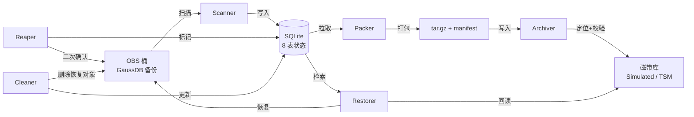
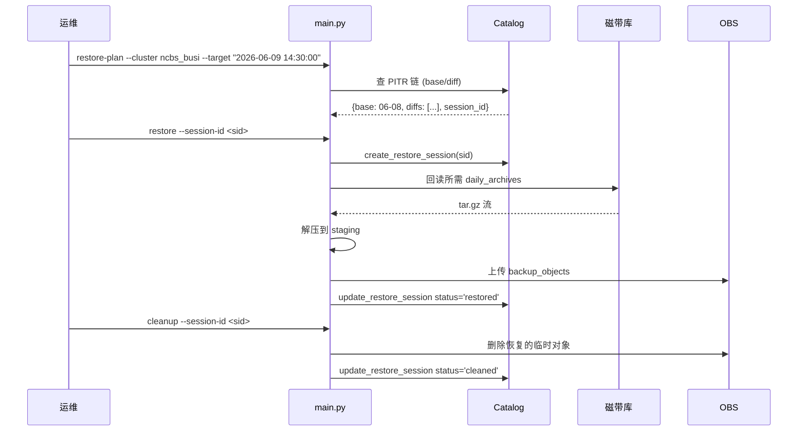

# gaussdb-archive

**GaussDB DBS 备份 → OBS → 中间机 → IBM 磁带库 归档与 PITR 恢复系统**

自动发现 GaussDB 在 OBS 桶中的全量/差异/快照/xlog 备份,按日打包写入 IBM 磁带库(支持模拟),清理已归档的 OBS 原始数据,并支持时间点恢复 (PITR)。

> 8 个核心模块 · 32 commits · 90/90 测试通过 · 20 轮模拟验证 6 个 P0/P1 修复

---

## 目录

- [项目目标](#项目目标)
- [架构设计](#架构设计)
- [执行流程](#执行流程)
- [安装](#安装)
- [使用](#使用)
- [Catalog 数据模型](#catalog-数据模型)
- [状态机](#状态机)
- [测试与质量](#测试与质量)
- [安全设计](#安全设计)
- [配置参考](#配置参考)
- [集群示例](#集群示例)

---

## 项目目标

DBS 备份在 OBS 上累积后,会长期占用对象存储成本。本系统在不打破 PITR 能力的前提下,将每日备份打包转储到磁带库并清理 OBS。

**核心约束**:
- **不丢恢复能力**: 转储后,任意历史时间点仍可恢复到 OBS(只要在 `retention_days` 窗口内)
- **Reaper 永不自启**: 删除线上 OBS 数据是单向破坏性操作,必须人工二次确认
- **集群隔离**: 多 GaussDB 实例共享同一份代码和磁带库,按 `instance_id` 严格隔离
- **状态可重入**: 任何步骤中断后可从 catalog 恢复进度,无需重新扫描

---

## 架构设计

### 数据流



### 模块清单

| 模块 | 职责 |
|---|---|
| `src/catalog.py` | SQLite 8 表状态库,事务隔离,UPSERT 语义 |
| `src/scanner.py` | OBS 增量扫描,PITR 链自动重建 |
| `src/packer.py` | 按日拉取 OBS 对象 → tar.gz + manifest.json + SHA256 |
| `src/archiver.py` | tar 写入磁带库,记录 position,回写 checksum |
| `src/tape_lib.py` | 磁带库抽象层 (SimulatedTapeLibrary 本地目录 / IBM TSM) |
| `src/reaper.py` | 6 道安全门禁 + ETag 二次校验,标记 `obs_deleted` |
| `src/restorer.py` | PITR 计划生成 + 执行 + Snapshot 独立恢复 |
| `src/cleaner.py` | 5 道门禁清理,完成态机收尾 |
| `src/obs_client.py` | OBS 客户端抽象 (生产 / Mock) |
| `src/policy.py` | 策略校验,运行时一致性检查 |
| `src/models.py` | dataclass: `Policy` / `BackupObject` / `DailyArchive` / `RestoreSession` |
| `src/errors.py` | 异常层级 (`ArchiveError` 基类) |
| `src/manifest.py` | tar 内部 `manifest.json` 生成 |
| `src/config.py` | 加载 `archive_config.json` |
| `src/cli.py` | argparse 子命令定义 |

### Catalog 设计

- **8 张表**: `instance_mappings` / `cluster_archive_policies` / `backup_objects` / `daily_archives` / `pitr_chains` / `restore_sessions` / `restore_objects` / `operation_log`
- **UPSERT 语义**: 同 `(instance_id, archive_date)` 重复操作幂等
- **跨集群天然隔离**: 所有业务表都带 `instance_id` 列
- **位置追踪**: `backup_objects.tape_volume` + `tape_position` 联合定位磁带上某字节
- **审计**: `operation_log` 记录每次状态变更 (含 `run_id` 用于分布式追踪)

### 磁带库抽象

`TapeLibrary` 协议统一两套实现:
- `SimulatedTapeLibrary`: 写入本地目录,文件名即 `volume/position` 编码,便于单机测试
- `IBMTapeLibrary`: 生产环境对接 IBM Spectrum Protect (实现见 `src/tape_lib.py`)

配额硬约束 (`max_volume_size_gb`),写入前预计算 `position` 是否溢出。

### PITR 链

- **基础**: 一次 `full` 备份,作为链的起点
- **增量**: 多个 `diff` 备份,记录每个 diff 目录名
- **xlog 窗口**: `[base_full_time, target_time + xlog_forward_hours]`,默认 ±6h
- **链自动重建**: `scanner.scan_instance` 末尾自动拼接新发现的全量/差异为一条链
- **开放链**: `chain_end_time = NULL` 表示未关闭,可匹配任意未来 `target_time`

---

## 执行流程

### 生产流水线顺序

```
Reaper → Restore → Cleaner    (硬约束,不可乱序)
   │         │          │
   │         │          └─ 依赖 backup_objects.status='obs_deleted' (Reaper 已删)
   │         └─ 从磁带库回读 tar,解压后回传 OBS
   └─ 人工触发,二次确认
```

**为什么 Cleaner 不能先于 Reaper?**
Cleaner 的"门禁 4"是 `backup_objects.status='obs_deleted'`,即"Reaper 已经把 OBS 原始备份删了"。如果先 Clean 但 Reaper 未执行,会从磁带恢复出对象到 OBS,产生重复文件;Reaper 的二次扫描会再次发现这些恢复出来的对象,陷入循环。

### 周度自动化 (Scheduler)

`scheduler.py` 是 **scan → pack → archive** 的编排入口,**不包含 Reaper**。Reaper 永远是人工触发。

```python
# scheduler.py 核心逻辑
def weekly_archive_job(config_path: str) -> None:
    cfg = load_config(config_path)
    cat = Catalog(cfg.catalog.path); cat.init_schema()
    obs = ObsClient.create_mock()  # 生产替换为真实 OBS SDK
    tape = TapeLibrary.create_simulated(...)
    work_dir = Path(cfg.work_dir)

    # Phase 1: scan
    s = Scanner(obs, cat)
    for ins in cfg.instances:
        if not ins.enabled: continue
        s.scan_instance(ins.instance_id, ins.policy)

    # Phase 2: pack (拉取所有 status='pending' 的 daily_archive)
    p = Packer(obs, cat, work_dir)
    for da in cat.list_daily_archives_by_status("pending"):
        p.pack_daily(da.instance_id, da.archive_date)

    # Phase 3: archive (写入磁带,update status='on_tape')
    a = Archiver(tape, cat)
    for da in cat.list_daily_archives_by_status("pending"):
        a.archive_to_tape(da.id, str(work_dir / da.archive_filename))
```

### PITR 恢复流程



---

## 安装

```bash
# 1. 克隆
git clone https://github.com/opswm/gaussdb-obs-tape-archive.git
cd gaussdb-obs-tape-archive

# 2. 创建虚拟环境
python -m venv .venv
source .venv/bin/activate  # Windows: .venv\Scripts\activate

# 3. 安装
pip install -e .

# 4. 准备配置
cp config/archive_config.json.example config/archive_config.json
$EDITOR config/archive_config.json
```

**环境变量** (凭证, **不要入库**):
```bash
export OBS_ACCESS_KEY="<your_key>"
export OBS_SECRET_KEY="<your_secret>"
```

配置文件中通过 `env:OBS_ACCESS_KEY` 自动读取。

---

## 使用

### CLI 子命令

| 子命令 | 用途 | 关键参数 | 是否可自动 |
|---|---|---|---|
| `scan` | 扫描 OBS,发现新备份 | `--cluster <alias>` (可选) | ✅ |
| `pack` | 按日打包为 tar.gz | `--cluster` `--date YYYY-MM-DD` | ✅ |
| `archive` | 写入磁带库 | `--full` (完整流水线) / `--cluster` | ✅ |
| `reap` | 标记 OBS 对象为 `obs_deleted` | `--cluster` `--date` `--dry-run` | ❌ 人工 |
| `restore-plan` | 生成 PITR 恢复计划 | `--cluster` `--target "YYYY-MM-DD HH:MM:SS"` | ❌ 人工 |
| `restore` | 执行恢复 (回读磁带 → 写 OBS) | `--cluster` `--target` `--session-id` | ❌ 人工 |
| `cleanup` | 清理恢复数据 (回写 OBS 后) | `--session-id` | ❌ 人工 |
| `status` | 查看集群归档状态 | `--cluster` `--date` | ✅ |

### 每周自动归档 (推荐)

```bash
# crontab -e
# 每周日 02:00 跑周度流水线 (scan → pack → archive)
0 2 * * 0 cd /path/to/gaussdb-archive && \
  /path/to/.venv/bin/python -m scheduler config/archive_config.json \
  >> /var/log/gaussdb-archive/weekly.log 2>&1
```

### 完整命令示例

```bash
# 扫描所有集群
python main.py --config config/archive_config.json scan

# 扫描指定集群
python main.py --config config/archive_config.json scan --cluster ncbs_busi

# 打包 06-08 的备份
python main.py --config config/archive_config.json pack --cluster ncbs_busi --date 2026-06-08

# 完整流水线: scan → pack → archive (单集群)
python main.py --config config/archive_config.json archive --full --cluster ncbs_busi

# 人工 Reap (删除 OBS 原始数据,先 dry-run 确认)
python main.py --config config/archive_config.json reap --cluster ncbs_busi --date 2026-06-08 --dry-run
python main.py --config config/archive_config.json reap --cluster ncbs_busi --date 2026-06-08

# PITR 恢复: 恢复到 2026-06-09 14:30:00
python main.py --config config/archive_config.json restore-plan --cluster ncbs_busi --target "2026-06-09 14:30:00"
# 输出形如: {session_id: "...", base_dir: "...", diff_dirs: [...], xlog_count: N}
python main.py --config config/archive_config.json restore --cluster ncbs_busi --target "2026-06-09 14:30:00" --session-id <sid>

# 清理已恢复的数据
python main.py --config config/archive_config.json cleanup --session-id <sid>

# 查看状态
python main.py --config config/archive_config.json status --cluster ncbs_busi
```

---

## Catalog 数据模型

### 8 张表

| 表 | 主键 | 用途 |
|---|---|---|
| `instance_mappings` | `instance_id` | 集群元数据 (alias / display_name / bucket / enabled) |
| `cluster_archive_policies` | `instance_id` | 归档策略 (4 个 archive_* 开关 + retention + xlog 窗口) |
| `backup_objects` | `id`, `obs_key UNIQUE` | OBS 原始对象清单 + 磁带位置 + 状态机 |
| `daily_archives` | `id`, `(instance_id, archive_date) UNIQUE` | 每日归档包 (一个 tar.gz) |
| `pitr_chains` | `chain_id` | PITR 链 (base_full_dir + diff_dirs + 时间窗口) |
| `restore_sessions` | `session_id` | 恢复会话 (target_time + 所需 daily_archives) |
| `restore_objects` | `(session_id, obs_key)` | 恢复产生的临时对象 (Cleaner 时清理) |
| `operation_log` | `id` | 操作审计 (run_id / status / error_message) |

### `backup_objects` 核心列

| 列 | 类型 | 用途 |
|---|---|---|
| `obs_key` | TEXT UNIQUE | OBS 全路径 (如 `{instance_id}/Db/{dir}/f.rch`) |
| `instance_id` | TEXT | 集群标识 |
| `backup_type` | TEXT | `full` / `diff` / `snapshot` / `xlog` / `metadata` |
| `parent_backup_dir` | TEXT | 备份时间戳目录名 (如 `1780160839955`) |
| `status` | TEXT | 状态机当前位置 (见下) |
| `tape_volume` | TEXT | 磁带卷号 (archive 后填) |
| `tape_position` | BIGINT | tar 内部字节偏移 |
| `daily_archive_id` | INT | 所属 daily_archive |
| `checksum_sha256` | TEXT | 写入磁带时计算 |
| `obs_etag` | TEXT | Reaper 二次校验用 |
| `obs_deleted_at` / `obs_deleted_by` | TEXT | Reaper 标记 |

---

## 状态机

### `backup_objects.status`

```
discovered ──scan──▶ queued_for_archive
                         │
                         ├──pack/archiver──▶ archived
                         │                       │
                         │                       ├──reaper──▶ obs_deleted
                         │                       │                 │
                         │                       │                 └──cleaner(无依赖)─▶ [终态]
                         │
                         └──pack 失败──▶ failed
```

### `daily_archives.status`

```
pending ──pack──▶ writing ──pack_done──▶ pending (待 archive)
                                              │
                                              └──archiver──▶ on_tape
```

### `restore_sessions.status`

```
retrieving ──tape_read──▶ extracting ──extract_done──▶ uploading
                                                           │
                                                           └──upload_done──▶ restored
                                                                              │
                                                                              ├──cleanup──▶ cleaning ──clean_done──▶ cleaned
                                                                              └──失败──▶ failed
```

---

## 测试与质量

### 单元 + 集成测试

```bash
pytest              # 90 用例, ~0.5s 全量
ruff check          # lint
```

### 测试矩阵

| 模块 | 测试文件 | 用例数 |
|---|---|---|
| archiver | `test_archiver.py` | 4 |
| catalog | `test_catalog.py` | 6 |
| cleaner | `test_cleaner.py` | 5 |
| cli | `test_cli.py` | 6 |
| config | `test_config.py` | 2 |
| e2e | `test_e2e.py` | 4 |
| errors | `test_errors.py` | 4 |
| models | `test_models.py` | 4 |
| obs_client | `test_obs_client.py` | 6 |
| packer | `test_packer.py` | 4 |
| policy | `test_policy.py` | 13 |
| reaper | `test_reaper.py` | 5 |
| restorer | `test_restorer.py` | 8 |
| scanner | `test_scanner.py` | 8 |
| tape_lib | `test_tape_lib.py` | 4 |
| **合计** | **15 文件** | **90** |

### 已修复的 6 个 P0/P1 缺陷

| Commit | 修复 |
|---|---|
| `9fb4abf` | PITR chain 自动重建 (scanner 末尾) |
| `4fe12f7` | PITR chain 重建整体事务化 |
| `42fb906` | Reaper ETag mismatch 硬失败 (不再静默继续) |
| `ec41eeb` | Cleaner 改 skip+failed, 终态 'failed' 标识运维介入 |
| `6133cb9` | Tape lib position 定位 + 排除 volume.meta + quota 严格 |
| `1352e31` | Cleaner 允许 'failed' + 空 restore_objects mark cleaned |
| `f172dab` | xlog 窗口边界 TZ 归一 (避免 naive vs aware 字符串比较错位) |

---

## 安全设计

### Reaper 6 道门禁

Reaper 是唯一接触"删除线上数据"的组件,必须通过 6 道检查才能标记 `obs_deleted`:

1. **类型门**: 只处理 `discovered` / `archived` (且 `daily_archive.status='on_tape'`) 的对象
2. **完整性门**: `daily_archive.checksum_sha256` 已校验通过
3. **依赖门**: 同 `parent_backup_dir` 的对象**全部** `archived`
4. **顺序门**: `full` → `diff` → `xlog` 严格顺序,**不能跳过** (跳 xlog 会导致 PITR 不连续)
5. **ETag 门**: 再次拉取 OBS ETag,必须等于扫描时记录的 `obs_etag` (防 OBS 端数据被改动)
6. **人为门**: CLI 必须显式触发,且不带 `--auto`

任何一道失败 → **硬失败**,**不静默跳过** (这与早期版本不同, 早期是 continue, 留下链断风险)。

### Cleaner 5 道门禁

1. 会话状态必须是 `restored` (未恢复完的对象不能删)
2. 每个 `restore_object` 的 `obs_etag` 仍存在
3. 源 `backup_object` 已是 `obs_deleted` (Reaper 跑过)
4. 同 `session_id` 所有对象**全部检查通过**才执行
5. 终态: `cleaned` (成功) / `failed` (运维介入)

### 凭证隔离

- 配置文件只存模板,真实凭证走 `env:` 占位符
- `.env` / `config/archive_config.json` / `.omc/` / `.claude/` 已在 `.gitignore`
- 历史已用 `git-filter-repo` 永久清理 (2026-06-11)

---

## 配置参考

`config/archive_config.json.example` 是完整模板,关键字段:

```json
{
  "obs": {
    "bucket_name": "dbsbucket-0-tj01-XXXX",
    "endpoint": "https://obs.tj01.xxxxx.myhuaweicloud.com",
    "access_key": "env:OBS_ACCESS_KEY",
    "secret_key": "env:OBS_SECRET_KEY",
    "concurrency": 8,
    "part_size_mb": 10
  },
  "instances": [
    {
      "alias": "ncbs_busi",
      "instance_id": "{tenant}_{instance}",
      "display_name": "核心数据库集群",
      "enabled": true,
      "archive_policy": {
        "archive_full": true, "archive_snapshot": true,
        "archive_diff": true, "archive_xlog": true,
        "retention_days": 90,
        "xlog_redundancy_hours": 6.0, "xlog_forward_hours": 6.0
      }
    }
  ],
  "tape": {
    "mode": "simulated",
    "simulated_path": "/data/tapes",
    "max_volume_size_gb": 12000,
    "verify_after_write": true
  },
  "catalog": {
    "path": "/data/catalog/gaussdb_archive.db",
    "backup_enabled": true,
    "backup_path": "/data/catalog/backups/",
    "backup_retention_days": 90
  },
  "work_dir": "/data/archive_work",
  "archive": {
    "required_manual_confirm_for_delete": true,
    "max_concurrent_pack_jobs": 3,
    "daily_archive_format": "tar.gz",
    "compression_level": 6
  },
  "restore": {
    "local_work_retention_hours": 24
  }
}
```

> ⚠️ `instance_id` 必须是**完整**的 `{tenant_id}_{instance_id}` 字符串 (来自 OBS 实际目录名), 不可简化为别名. `alias` 才是简称 (如 `ncbs_busi`)。

### 策略字段说明

| 字段 | 含义 |
|---|---|
| `archive_full` | 是否归档全量备份 |
| `archive_snapshot` | 是否归档快照 |
| `archive_diff` | 是否归档差异备份 (关掉 = 无 PITR) |
| `archive_xlog` | 是否归档事务日志 (关掉 = 无 PITR) |
| `retention_days` | 磁带保留天数 (到期后由外部流程覆盖) |
| `xlog_redundancy_hours` | xlog 窗口前向冗余 (默认 6h) |
| `xlog_forward_hours` | xlog 窗口后向冗余 (默认 6h, PITR 必备) |

**PITR 能力判定**: `archive_full AND archive_diff AND archive_xlog` 全部为 `true` 才支持任意时间点恢复。

---

## 集群示例

| alias | display_name | 策略 |
|---|---|---|
| `ncbs_busi` | 核心数据库集群 | full + snapshot + diff + xlog ✅ PITR |
| `trgl_busi` | 总账数据库集群 | full + snapshot + diff + xlog ✅ PITR |
| `itps_busi` | 柜面数据库集群 | full + snapshot + diff (无 xlog) ❌ 仅快照恢复 |

---

## License

内部运维工具,未开源。
