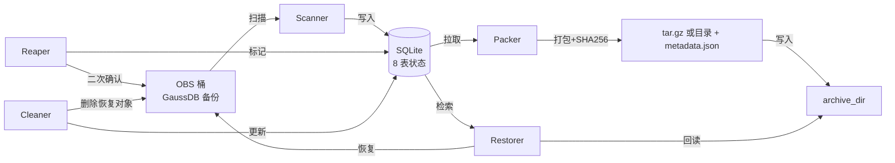

# gaussdb-archive

**GaussDB DBS 备份 → OBS → 归档目录 (周度/日度打包 + PITR 恢复系统)**

自动发现 GaussDB 在 OBS 桶中的全量/差异/快照/xlog 备份,按**周度**或**日度**(per-cluster 可配置)打包到配置的 `archive_dir` 目录,跳过元数据,严格按 xlog 时间窗过滤,支持压缩/非压缩模式,清理已归档的 OBS 原始数据,并支持时间点恢复 (PITR)。

> 16 个核心模块 · 148/148 测试通过 · 13 个原子 Commit

---

## 目录

- [项目目标](#项目目标)
- [架构设计](#架构设计)
- [执行流程](#执行流程)
- [安装](#安装)
- [完整参数参考](#完整参数参考)
- [子命令详细说明](#子命令详细说明)
- [场景演练](#场景演练)
- [Catalog 数据模型](#catalog-数据模型)
- [状态机](#状态机)
- [测试与质量](#测试与质量)
- [测试环境](#测试环境)
- [安全设计](#安全设计)
- [配置参考](#配置参考)
- [集群示例](#集群示例)

---

## 项目目标

DBS 备份在 OBS 上累积后,会长期占用对象存储成本。本系统在不打破 PITR 能力的前提下,将备份**周度或日度打包**转储到 `archive_dir`,并清理 OBS。

**核心约束**:
- **不丢恢复能力**: 转储后,任意历史时间点仍可恢复到 OBS (只要在 `retention_days` 窗口内)
- **Reaper 永不自启**: 删除线上 OBS 数据是单向破坏性操作,必须人工二次确认 (或显式 `--yes`)
- **集群隔离**: 多 GaussDB 实例共享同一份代码和归档目录,按 `instance_id` 严格隔离
- **状态可重入**: 任何步骤中断后可从 catalog 恢复进度,无需重新扫描
- **周度/日度可选**: `archive.mode: "weekly"|"daily"`, 周度按 `week_start_day` 边界, 日度按 `backup_date`
- **压缩可控**: `archive.compress: true|false`, false 时直接拷贝文件到目录, 不打包 tar.gz
- **xlog-only**: `Log/` 目录仅打包 xlog 分片,5 类元数据 (obs_last_clean_record 等) 与根级 metadata 一律跳过

---

## 架构设计

### 数据流



### 模块清单

| 模块 | 职责 |
|---|---|
| `src/catalog.py` | SQLite 8 表状态库,事务隔离,UPSERT 语义 |
| `src/scanner.py` | OBS 增量扫描,PITR 链自动重建,元数据归档但不上传 |
| `src/packer.py` | 周度/日度打包到 archive_dir,过滤 metadata, xlog 时间窗,支持压缩/非压缩 |
| `src/manifest.py` | metadata.json 构造: 集群 + 周期范围 (UTC+Beijing) + 详细目录条目 + xlog 摘要 |
| `src/storage_estimator.py` | 待归档存储估算 + 磁盘空间预检 (pack-all-weeks/pack-all-days 必备) |
| `src/utils.py` | 时区工具: utc_to_beijing, format_beijing |
| `src/week_boundary.py` | 周度边界计算: compute_week_range(today, week_start_day) |
| `src/reaper.py` | 5 道安全门禁 + ETag 二次校验,标记 `obs_deleted` |
| `src/restorer.py` | PITR 计划生成 + 执行 + Snapshot 独立恢复,从 archive_dir 读 |
| `src/cleaner.py` | 5 道门禁清理,完成态机收尾 |
| `src/obs_client.py` | OBS 客户端抽象 (生产 / Mock) |
| `src/policy.py` | 策略校验,运行时一致性检查, week_start_day 1-7 校验 |
| `src/models.py` | dataclass: `Policy` / `BackupObject` / `DailyArchive` / `RestoreSession` |
| `src/errors.py` | 异常层级 (`ArchiveError` 基类) |
| `src/config.py` | 加载 `archive_config.json` |
| `src/cli.py` | argparse 子命令定义 (12 个子命令 + cluster 子解析器) |

### 归档目录 (archive_dir)

`archive_dir` 字段 (顶层配置) 指定一个**目录路径**。Packer 把归档文件写入该目录,Restorer 从该目录读取:
- 压缩模式 (`compress=true`): 写 `{name}.tar.gz`
- 非压缩模式 (`compress=false`): 写 `{name}/` 目录,内含备份文件 + `metadata.json`
- 无需磁带卷管理、无需 position、无需 quota、无需回读校验 (本地 SHA256 即可)

### 归档命名

**周度** (`mode: "weekly"`):
```
{alias}_W{start_YYYYMMDD}_{end_YYYYMMDD}.tar.gz
```
例: `ncbs_busi_W20260530_20260606.tar.gz`

**日度** (`mode: "daily"`):
```
{date_YYYYMMDD}_{alias}.tar.gz          # 压缩
{date_YYYYMMDD}_{alias}/                # 非压缩
```
例: `20260601_ncbs_busi.tar.gz` 或 `20260601_ncbs_busi/`

### PITR 链

- **基础**: 一次 `full` 备份,作为链的起点
- **增量**: 多个 `diff` 备份,记录每个 diff 目录名
- **xlog 窗口**: `[base_full_time, target_time + xlog_forward_hours]`,默认 ±6h
- **链自动重建**: `scanner.scan_instance` 末尾自动拼接新发现的全量/差异为一条链
- **开放链**: `chain_end_time = NULL` 表示未关闭,可匹配任意未来 `target_time`

---

## 执行流程

### 周度流水线

```
scan → queued_for_archive → pack_weekly (per-cluster 当前周) → archive_dir
   │         │                       │
   │         │                       └─ 过滤 metadata / archive_only; xlog 时间窗
   │         └─ 调度器自动推进 (discovered → queued_for_archive)
   └─ Reaper 永不自启, 单独人工触发子命令 reap --week-start YYYY-MM-DD
```

### 日度流水线

```
scan → queued_for_archive → pack_daily (per-cluster 指定日期) → archive_dir
   │         │                       │
   │         │                       └─ 过滤 metadata / archive_only; xlog 按日期时间窗
   │         └─ 调度器自动推进 (discovered → queued_for_archive)
   └─ Reaper 永不自启
```

### metadata.json

```json
{
  "schema_version": "2.0",
  "archive_type": "weekly",
  "cluster": {
    "alias": "ncbs_busi",
    "instance_id": "tenant_a_dbbd7e9b_ncbs_busi",
    "display_name": "核心数据库集群",
    "bucket": "dbsbucket-0-tj01-xxxx"
  },
  "archive_period": {
    "week_start_day": 6,
    "week_start_utc": "2026-05-30T00:00:00+00:00",
    "week_end_utc": "2026-06-06T00:00:00+00:00",
    "week_start_beijing": "2026-05-30 08:00:00 (UTC+8)",
    "week_end_beijing": "2026-06-06 08:00:00 (UTC+8)"
  },
  "contents": {
    "full_dirs": [
      {"dir_name": "1780160839955", "timestamp_ms": 1780160839955,
       "utc": "2026-05-30T10:27:19+00:00", "beijing": "2026-05-30 18:27:19"}
    ],
    "diff_dirs": [...],
    "snapshot_dirs": [],
    "xlog_summary": {
      "count": 128,
      "last_modified_first_utc": "...", "last_modified_last_utc": "...",
      "last_modified_first_beijing": "...", "last_modified_last_beijing": "...",
      "lsn_start": "0000000100000000000000A0",
      "lsn_end":   "0000000100000000000000F8"
    }
  },
  "totals": {
    "full_count": 1, "diff_count": 6, "snapshot_count": 0, "xlog_count": 128,
    "metadata_skipped_count": 12,
    "total_uncompressed_bytes": 9876543210,
    "compressed_tar_bytes": 1234567890
  },
  "checksum_sha256": "abc123...tar.gz.sha256"
}
```

日度模式下的 `archive_period`:
```json
{
  "archive_period": {
    "date_utc": "2026-06-15T00:00:00+00:00",
    "date_beijing": "2026-06-15 08:00:00 (UTC+8)"
  }
}
```

### Preview 模式 (--preview)

`pack-weekly --preview` 或 `pack-daily --preview` 输出**人类可读**计划清单, 含 Beijing time 转换:

```
集群: ncbs_busi (核心)
周度范围: 2026-05-30 08:00:00 (UTC+8) → 2026-06-06 08:00:00 (UTC+8)
周起点: 6 (1=周一..7=周日)

全量目录 (1 个):
  - 1780160839955 → Beijing=2026-05-31 09:07:19 (UTC=2026-05-31T01:07:19.955000+00:00)
差异目录 (1 个):
  - 1780177759671 → Beijing=2026-05-31 13:49:19 (UTC=...)
xlog 文件 (1 个):
  - last_modified 范围: 2026-06-03 18:00:00 → 2026-06-03 18:00:00
元数据 (跳过, archive_only): 2 个
```

无任何 IO, 不下载不写盘不创建 daily_archive 行。

### PITR 恢复流程


---

## 安装

```bash
git clone https://github.com/opswm/gaussdb-obs-tape-archive.git
cd gaussdb-obs-tape-archive
pip3 install -e .
cp config/archive_config.json.example config/archive_config.json
$EDITOR config/archive_config.json
```

> **无需虚拟环境** — 直接使用系统 `python3` + `pip3 install -e .` 即可。如需隔离,可选择 `pip3 install --user -e .` 或 `pipx`。

**环境变量** (凭证, **不要入库**):
```bash
export OBS_ACCESS_KEY="<your_key>"
export OBS_SECRET_KEY="<your_secret>"
```

---

## 完整参数参考

| 参数 | 类型 | 默认值 | 适用命令 | 说明 |
|---|---|---|---|---|
| `--config` | PATH | **必填** | 全部 | `archive_config.json` 路径 |
| `--cluster` | STRING | 必填/可选 | `scan` (可选), `pack-weekly`/`pack`/`pack-daily`/`pack-all-weeks`/`pack-all-days`/`reap`/`restore-plan`/`restore`/`status`/`cluster show` (必填) | 集群 `alias`(如 `ncbs_busi`) |
| `--week-start` | YYYY-MM-DD | 当前周 | `pack-weekly`/`pack`/`pack-all-weeks`/`reap`/`status` | 周起始日;`pack-weekly` 不传则取本集群当前周,`reap` 必填 |
| `--date` | YYYY-MM-DD | 今天 | `pack-daily`/`pack-all-days` | 归档日期;不传则取今天 |
| `--preview` / `--dry-run` | flag | `False` | `pack-weekly`/`pack`/`pack-daily` | 预览模式,仅输出计划不下载不写盘 |
| `--target` | "YYYY-MM-DD HH:MM:SS" | **必填** | `restore-plan`/`restore` | PITR 目标时间 (Beijing time) |
| `--session-id` | UUID/字符串 | **必填** | `restore`/`cleanup` | 恢复会话 ID, 由 `restore-plan` 生成 |
| `--dry-run` | flag | `False` | `reap` | 仅显示将被删除的对象,不做任何 IO |
| `--yes` | flag | `False` | `reap`/`restore`/`cleanup` | 跳过交互式确认,**危险**:直接执行破坏性操作,自动化场景使用 |
| `--stop-on-error` | flag | `False` | `pack-all-weeks`/`pack-all-days` | 任一周/日失败立即中止,默认记录错误继续 |

**退出码**:
| 退出码 | 含义 |
|---|---|
| `0` | 成功 |
| `1` | 一般业务错误 (配置缺失/参数错误/权限不足) |
| `2` | Reaper 5 道门禁未通过 (`UnsafeDeleteError`) |
| `3` | 磁盘空间不足 (storage_estimator 预检失败) |
| `4` | 恢复链路缺失 (无 PITR 链匹配 target_time) |

---

## 子命令详细说明

### 1. `scan` — 扫描 OBS 发现新备份

```bash
python3 main.py --config config/archive_config.json scan
python3 main.py --config config/archive_config.json scan --cluster ncbs_busi
```

**参数说明**:
- `--cluster`(可选): 不传则扫描配置中所有 `enabled=true` 的集群

**典型输出**:
```
[2026-06-12 02:00:01] 开始扫描: 2 个集群
[2026-06-12 02:00:01]   - ncbs_busi (tenant_a_dbbd7e9b_ncbs_busi)
[2026-06-12 02:00:01]   - trgl_busi (tenant_a_dbbd7e9b_trgl_busi)
[2026-06-12 02:00:03] ncbs_busi: 发现 47 个新对象, 12 个 metadata (archive_only)
[2026-06-12 02:00:03]   - 35 个 queued_for_archive
[2026-06-12 02:00:03]   - 1 个全量目录, 6 个差异, 0 个快照, 28 个 xlog
[2026-06-12 02:00:05] trgl_busi: 发现 18 个新对象, 5 个 metadata (archive_only)
[2026-06-12 02:00:05]   - 13 个 queued_for_archive
[2026-06-12 02:00:05]   - 0 个全量目录, 4 个差异, 0 个快照, 9 个 xlog
[2026-06-12 02:00:05] PITR 链自动重建: ncbs_busi 1 条新链, trgl_busi 0 条
[2026-06-12 02:00:05] 扫描完成 (耗时 4.2s)

待归档总大小: 124.7 GB
archive_dir 可用空间: 18.3 TB

按周分解:
  ncbs_busi    2026-05-30~2026-06-06:    87.2 GB  (1 full, 6 diff, 0 snap, 28 xlog)
  trgl_busi    2026-05-26~2026-06-02:    37.5 GB  (0 full, 4 diff, 0 snap, 9 xlog)

磁盘空间: 充足 (需要 ~249.4 GB, 可用 18.3 TB)
```

**退出码**: `0` 成功

---

### 2. `pack-weekly` / `pack` — 周度打包 (推荐)

```bash
# 当前周 (按集群 week_start_day 自动算)
python3 main.py --config config/archive_config.json pack-weekly --cluster ncbs_busi

# 指定周
python3 main.py --config config/archive_config.json pack-weekly --cluster ncbs_busi --week-start 2026-05-30

# 预览
python3 main.py --config config/archive_config.json pack-weekly --cluster ncbs_busi --preview
```

**参数说明**:
- `--cluster`(必填): 集群 alias
- `--week-start`(可选): 周起始日;不传则按本集群 `week_start_day` 算当前周
- `--preview`/`--dry-run`(flag): 仅打印计划,不做任何 IO

**典型输出 (执行模式)**:
```
[2026-06-12 02:05:01] ncbs_busi: 准备打包周 2026-05-30 → 2026-06-06
[2026-06-12 02:05:01]   周起点 day=6 (周六), Beijing 范围 2026-05-30 08:00 → 2026-06-06 08:00
[2026-06-12 02:05:02]   全量 1, 差异 6, 快照 0, xlog 28, metadata 跳过 12
[2026-06-12 02:05:02]   预估压缩前: 87.2 GB
[2026-06-12 02:05:02]   下载 OBS 对象: 100%|████████████| 35/35 [00:42<00:00, 0.83 it/s]
[2026-06-12 02:05:44]   打包: /data/tape-mapping/ncbs_busi_W20260530_20260606.tar.gz
[2026-06-12 02:06:31]   压缩后: 18.4 GB (压缩率 78.9%)
[2026-06-12 02:06:31]   计算 SHA256: a3f2b9c1d4e5...
[2026-06-12 02:06:33]   写入 metadata.json (1.2 KB)
[2026-06-12 02:06:33]   更新 catalog: daily_archive_id=128, status=archived
[2026-06-12 02:06:33]   backup_objects: 35 个 → archived
[2026-06-12 02:06:33] 完成 (耗时 92.4s)
```

**典型输出 (preview 模式)**:
```
集群: ncbs_busi (核心数据库集群)
周度范围: 2026-05-30 08:00:00 (UTC+8) → 2026-06-06 08:00:00 (UTC+8)
周起点: 6 (1=周一..7=周日)

全量目录 (1 个):
  - 1780160839955 → Beijing=2026-05-31 09:07:19 (UTC=2026-05-31T01:07:19.955000+00:00)
差异目录 (6 个):
  - 1780177759671 → Beijing=2026-05-31 13:49:19 (UTC=...)
  - 1780194681003 → Beijing=2026-06-01 18:31:21 (UTC=...)
  - 1780211602335 → Beijing=2026-06-02 14:33:22 (UTC=...)
  - 1780228523710 → Beijing=2026-06-03 19:48:43 (UTC=...)
  - 1780245445086 → Beijing=2026-06-04 16:37:25 (UTC=...)
  - 1780262366501 → Beijing=2026-06-05 14:39:26 (UTC=...)
xlog 文件 (28 个):
  - last_modified 范围: 2026-05-30 18:00:00 → 2026-06-05 17:59:59 (Beijing)
  - LSN: 0000000100000000000000A0 → 0000000100000000000000F8
元数据 (跳过, archive_only): 12 个
预估压缩前: 87.2 GB
```

**退出码**: `0` 成功,`3` 磁盘空间不足

---

### 3. `pack-daily` — 日度打包

```bash
# 当天 (按 backup_date 过滤)
python3 main.py --config config/archive_config.json pack-daily --cluster ncbs_busi

# 指定日期
python3 main.py --config config/archive_config.json pack-daily --cluster ncbs_busi --date 2026-06-15

# 预览
python3 main.py --config config/archive_config.json pack-daily --cluster ncbs_busi --preview
```

**参数说明**:
- `--cluster`(必填): 集群 alias
- `--date`(可选): 归档日期 YYYY-MM-DD;不传则取今天
- `--preview`/`--dry-run`(flag): 仅打印计划,不做任何 IO

**典型输出 (压缩模式, compress=true)**:
```
[2026-06-15 02:05:01] ncbs_busi: 准备打包日期 2026-06-15
[2026-06-15 02:05:02]   全量 1, 差异 0, 快照 0, xlog 12, metadata 跳过 2
[2026-06-15 02:05:02]   下载 OBS 对象: 100%|████████████| 13/13 [00:15<00:00, 0.87 it/s]
[2026-06-15 02:05:17]   打包: /archive/20260615_ncbs_busi.tar.gz
[2026-06-15 02:05:20]   计算 SHA256: b4e2c9f1d3a5...
[2026-06-15 02:05:20]   更新 catalog: daily_archive_id=256, status=archived, archive_type=daily
[2026-06-15 02:05:20] 完成 (耗时 19.2s)
```

**典型输出 (非压缩模式, compress=false)**:
```
[2026-06-15 02:05:01] ncbs_busi: 准备打包日期 2026-06-15
[2026-06-15 02:05:02]   全量 1, 差异 0, 快照 0, xlog 12, metadata 跳过 2
[2026-06-15 02:05:02]   下载 OBS 对象: 100%|████████████| 13/13 [00:15<00:00, 0.87 it/s]
[2026-06-15 02:05:17]   拷贝到: /archive/20260615_ncbs_busi/
[2026-06-15 02:05:18]   计算 SHA256 (metadata.json): b4e2c9f1d3a5...
[2026-06-15 02:05:18]   更新 catalog: daily_archive_id=257, status=archived, archive_type=daily
[2026-06-15 02:05:18] 完成 (耗时 17.1s)
```

**退出码**: `0` 成功,`3` 磁盘空间不足

---

### 4. `pack-all-weeks` — 逐周打包所有待处理周 (首次大规模导入)

```bash
# 逐周打包该集群所有 queued_for_archive 对象
python3 main.py --config config/archive_config.json pack-all-weeks --cluster ncbs_busi

# 失败立即中止
python3 main.py --config config/archive_config.json pack-all-weeks --cluster ncbs_busi --stop-on-error
```

**参数说明**:
- `--cluster`(必填): 集群 alias
- `--stop-on-error`(flag): 任一周失败立即中止;默认记录错误并继续

**典型输出**:
```
[2026-06-12 03:00:01] ncbs_busi: 查找待处理周...
[2026-06-12 03:00:01]   发现 4 个待处理周

==================================================
  存储估算
==================================================
待归档总大小: 327.4 GB (327,400,000,000 bytes)
archive_dir 可用空间: 18.3 TB

按周分解:
  ncbs_busi    2026-04-04~2026-04-10:    78.2 GB  (1 full, 5 diff, 0 snap, 22 xlog)
  ncbs_busi    2026-04-11~2026-04-17:    82.1 GB  (0 full, 7 diff, 0 snap, 24 xlog)
  ncbs_busi    2026-04-18~2026-04-24:    79.5 GB  (0 full, 6 diff, 0 snap, 25 xlog)
  ncbs_busi    2026-05-30~2026-06-06:    87.6 GB  (1 full, 6 diff, 0 snap, 28 xlog)

磁盘空间: 充足 (需要 ~654.8 GB, 可用 18.3 TB)
==================================================

[2026-06-12 03:00:02] 开始逐周打包: 4 周
[2026-06-12 03:00:02] ==========================================
[2026-06-12 03:00:02] [1/4] 周 2026-04-04 → 2026-04-10
[2026-06-12 03:01:35] [1/4]  ✓ 完成: ncbs_busi_W20260404_20260410.tar.gz (16.5 GB)
[2026-06-12 03:01:35] ==========================================
[2026-06-12 03:01:35] [2/4] 周 2026-04-11 → 2026-04-17
[2026-06-12 03:03:08] [2/4]  ✓ 完成: ncbs_busi_W20260411_20260417.tar.gz (17.3 GB)
[2026-06-12 03:03:08] ==========================================
[2026-06-12 03:03:08] [3/4] 周 2026-04-18 → 2026-04-24
[2026-06-12 03:04:41] [3/4]  ✓ 完成: ncbs_busi_W20260418_20260424.tar.gz (16.8 GB)
[2026-06-12 03:04:41] ==========================================
[2026-06-12 03:04:41] [4/4] 周 2026-05-30 → 2026-06-06
[2026-06-12 03:06:14] [4/4]  ✓ 完成: ncbs_busi_W20260530_20260606.tar.gz (18.4 GB)

[2026-06-12 03:06:14] 全部完成: 4/4 周成功, 0 失败
[2026-06-12 03:06:14] 总耗时: 372.5s
[2026-06-12 03:06:14] 累计归档: 69.0 GB
```

**退出码**: `0` 全部成功,`3` 磁盘空间不足,失败周数 > 0 时退出码为 `1` 但仍输出已完成周数

---

### 5. `pack-all-days` — 逐日打包所有待处理日

```bash
# 逐日打包该集群所有 queued_for_archive 对象
python3 main.py --config config/archive_config.json pack-all-days --cluster ncbs_busi

# 失败立即中止
python3 main.py --config config/archive_config.json pack-all-days --cluster ncbs_busi --stop-on-error
```

**参数说明**:
- `--cluster`(必填): 集群 alias
- `--stop-on-error`(flag): 任一日失败立即中止;默认记录错误并继续

**典型输出**:
```
[2026-06-15 03:00:01] ncbs_busi: 发现 7 个待打包日期
[2026-06-15 03:00:01]   待打包: 2026-06-08, 2026-06-09, 2026-06-10, 2026-06-11, 2026-06-12, 2026-06-13, 2026-06-14

[2026-06-15 03:00:02] ==========================================
[2026-06-15 03:00:02] [1/7] 日期 2026-06-08
[2026-06-15 03:00:20] [1/7]  ✓ 完成: 20260608_ncbs_busi.tar.gz (2.1 GB)
[2026-06-15 03:00:20] [2/7] 日期 2026-06-09
[2026-06-15 03:00:38] [2/7]  ✓ 完成: 20260609_ncbs_busi.tar.gz (2.3 GB)
...
[2026-06-15 03:02:30] 全部完成: 7/7 天成功, 0 失败
[2026-06-15 03:02:30] 总耗时: 148.5s
```

**退出码**: `0` 全部成功,失败天数 > 0 时退出码为 `1`

---

### 6. `reap` — 安全删除 OBS 原始数据

```bash
# Dry run (查看将被删除的对象)
python3 main.py --config config/archive_config.json reap --cluster ncbs_busi --week-start 2026-05-30 --dry-run

# 交互式确认
python3 main.py --config config/archive_config.json reap --cluster ncbs_busi --week-start 2026-05-30

# 自动化场景:跳过确认
python3 main.py --config config/archive_config.json reap --cluster ncbs_busi --week-start 2026-05-30 --yes
```

**参数说明**:
- `--cluster`(必填): 集群 alias
- `--week-start`(必填): 要清理的周起始日
- `--dry-run`(flag): 仅显示计划,不删除
- `--yes`(flag): 跳过交互式确认 (默认会有 y/N 提示)

**典型输出 (dry-run)**:
```
[2026-06-12 04:00:01] ncbs_busi: 准备 Reap 周 2026-05-30 → 2026-06-06
[2026-06-12 04:00:01]   找到 35 个 archived 对象
[2026-06-12 04:00:01]   5 道门禁预检:
[2026-06-12 04:00:01]     [1/5] 类型门: daily_archive=archived ✓
[2026-06-12 04:00:01]     [2/5] 完整性门: 35/35 状态=archived, SHA256 存在 ✓
[2026-06-12 04:00:01]     [3/5] 依赖门: 全部 parent_backup_dir 已 archived ✓
[2026-06-12 04:00:01]     [4/5] 顺序门: 1 full + 6 diff + 28 xlog = 35 ✓
[2026-06-12 04:00:01]     [5/5] ETag 门: 35/35 ETag 匹配 (拉取耗时 2.1s) ✓
[2026-06-12 04:00:03]   DRY-RUN: 不会执行删除
[2026-06-12 04:00:03]   将删除 35 个 OBS 对象 (总 87.2 GB 释放)
[2026-06-12 04:00:03]     - 1 个全量目录
[2026-06-12 04:00:03]     - 6 个差异目录
[2026-06-12 04:00:03]     - 28 个 xlog 文件
[2026-06-12 04:00:03]     - (12 个 metadata 跳过, 仍保留在 OBS)
```

**典型输出 (执行模式)**:
```
[2026-06-12 04:05:01] ncbs_busi: 准备 Reap 周 2026-05-30 → 2026-06-06
[2026-06-12 04:05:01]   5 道门禁预检通过
[2026-06-12 04:05:03]   ⚠  警告: 此操作将永久删除 35 个 OBS 对象 (87.2 GB)
[2026-06-12 04:05:03]   确认执行? [y/N]: y
[2026-06-12 04:05:05]   删除 OBS 对象: 100%|████████████| 35/35 [00:18<00:00, 1.94 it/s]
[2026-06-12 04:05:23]   更新 catalog: 35 个 → obs_deleted
[2026-06-12 04:05:23] 完成 (耗时 22.1s)
```

**退出码**: `0` 成功,`2` 5 道门禁未通过 (`UnsafeDeleteError`)

---

### 7. `restore-plan` — 生成 PITR 恢复计划

```bash
python3 main.py --config config/archive_config.json restore-plan --cluster ncbs_busi --target "2026-06-04 14:30:00"
```

**参数说明**:
- `--cluster`(必填)
- `--target`(必填): PITR 目标时间 (Beijing time, 格式 `YYYY-MM-DD HH:MM:SS`)

**典型输出**:
```
[2026-06-12 10:00:01] ncbs_busi: 生成 PITR 恢复计划
[2026-06-12 10:00:01]   目标时间: 2026-06-04 14:30:00 (Beijing)
[2026-06-12 10:00:01]   查找匹配 PITR 链...
[2026-06-12 10:00:01]   找到链: chain_id=42
[2026-06-12 10:00:01]     base_full: 1780160839955 (2026-05-30 10:27:19 UTC)
[2026-06-12 10:00:01]     diffs: 3 个 (覆盖 2026-05-30 → 2026-06-03)
[2026-06-12 10:00:01]     xlog 窗口: [2026-05-30 10:27:19, 2026-06-04 20:30:00]
[2026-06-12 10:00:01]   所需 daily_archives:
[2026-06-12 10:00:01]     - ncbs_busi_W20260530_20260606.tar.gz
[2026-06-12 10:00:01]   session_id: rs_20260612_100001_a3f2b9
[2026-06-12 10:00:01] 恢复计划已写入 catalog, session_id=rs_20260612_100001_a3f2b9
[2026-06-12 10:00:01] 下一步: restore --session-id rs_20260612_100001_a3f2b9
```

**退出码**: `0` 成功,`4` 无匹配 PITR 链

---

### 8. `restore` — 执行 PITR 恢复

```bash
# 交互式确认
python3 main.py --config config/archive_config.json restore --cluster ncbs_busi --target "2026-06-04 14:30:00" --session-id rs_20260612_100001_a3f2b9

# 自动化:跳过确认
python3 main.py --config config/archive_config.json restore --cluster ncbs_busi --target "2026-06-04 14:30:00" --session-id rs_20260612_100001_a3f2b9 --yes
```

**参数说明**:
- `--cluster`(必填)
- `--target`(必填): 必须与 `restore-plan` 时一致
- `--session-id`(必填): 由 `restore-plan` 生成
- `--yes`(flag): 跳过交互式确认

**典型输出**:
```
[2026-06-12 10:05:01] ncbs_busi: 开始恢复 session=rs_20260612_100001_a3f2b9
[2026-06-12 10:05:01]   读取归档: ncbs_busi_W20260530_20260606.tar.gz (18.4 GB)
[2026-06-12 10:05:34]   解压 staging: /data/archive_work/restore/rs_20260612_100001_a3f2b9
[2026-06-12 10:05:48]   过滤 archive_only: 跳过 12 个 metadata
[2026-06-12 10:05:48]   待恢复对象: 35 个
[2026-06-12 10:05:48]   ⚠  警告: 将向 OBS 上传 35 个对象
[2026-06-12 10:05:48]   确认执行? [y/N]: y
[2026-06-12 10:05:50]   上传 OBS: 100%|████████████| 35/35 [02:15<00:00, 0.26 it/s]
[2026-06-12 10:08:05]   更新 catalog: restore_session.status=restored
[2026-06-12 10:08:05] 完成 (耗时 184.2s)
[2026-06-12 10:08:05] 恢复对象保留至 cleanup --session-id rs_20260612_100001_a3f2b9
```

**退出码**: `0` 成功,`4` 链路缺失

---

### 9. `cleanup` — 清理已恢复数据

```bash
# 交互式确认
python3 main.py --config config/archive_config.json cleanup --session-id rs_20260612_100001_a3f2b9

# 自动化
python3 main.py --config config/archive_config.json cleanup --session-id rs_20260612_100001_a3f2b9 --yes
```

**参数说明**:
- `--session-id`(必填)
- `--yes`(flag): 跳过交互式确认

**典型输出**:
```
[2026-06-12 11:00:01] 清理 session=rs_20260612_100001_a3f2b9
[2026-06-12 11:00:01]   5 道门禁预检:
[2026-06-12 11:00:01]     [1/5] 会话状态: restored ✓
[2026-06-12 11:00:01]     [2/5] ETag 校验: 35/35 存在 ✓
[2026-06-12 11:00:01]     [3/5] 源 backup_object 状态: obs_deleted ✓
[2026-06-12 11:00:01]     [4/5] session 内对象一致: 35/35 ✓
[2026-06-12 11:00:01]     [5/5] 终态校验: ready ✓
[2026-06-12 11:00:01]   ⚠  警告: 将删除 35 个 OBS 恢复对象
[2026-06-12 11:00:01]   确认执行? [y/N]: y
[2026-06-12 11:00:03]   删除 OBS 对象: 100%|████████████| 35/35 [00:14<00:00, 2.50 it/s]
[2026-06-12 11:00:17]   更新 catalog: status=cleaned
[2026-06-12 11:00:17] 完成 (耗时 16.4s)
```

**退出码**: `0` 成功,`2` 5 道门禁未通过

---

### 10. `status` — 查看集群归档状态

```bash
# 集群汇总
python3 main.py --config config/archive_config.json status --cluster ncbs_busi

# 指定周
python3 main.py --config config/archive_config.json status --cluster ncbs_busi --week-start 2026-05-30
```

**参数说明**:
- `--cluster`(必填)
- `--week-start`(可选): 不传则汇总全部

**典型输出 (汇总)**:
```
集群: ncbs_busi (核心数据库集群)
策略: full+snapshot+diff+xlog, week_start_day=6, retention=90 天
PITR 能力: ✓

catalog 统计:
  backup_objects 总数: 12,847
  - discovered: 0
  - queued_for_archive: 35
  - archived: 12,700
  - obs_deleted: 112

归档 (最近 5):
  2026-05-30 ~ 2026-06-06  type=weekly  status=archived  size=18.4 GB  objects=35
  2026-05-23 ~ 2026-05-29  type=weekly  status=archived  size=17.2 GB  objects=33
  2026-06-15                 type=daily   status=archived  size=2.1 GB   objects=13
  2026-06-14                 type=daily   status=archived  size=2.3 GB   objects=14
  2026-06-13                 type=daily   status=archived  size=2.0 GB   objects=12

PITR 链: 6 条活跃
待归档预估: 87.2 GB
```

**退出码**: `0` 成功

---

### 11. `cluster` — 集群管理

```bash
# 列出所有集群
python3 main.py --config config/archive_config.json cluster list

# 显示指定集群详情
python3 main.py --config config/archive_config.json cluster show --cluster ncbs_busi
```

**典型输出 (`cluster list`)**:
```
alias         instance_id                              display_name       enabled  week_start_day
ncbs_busi     tenant_a_dbbd7e9b_ncbs_busi              核心数据库集群      True     6 (周六)
trgl_busi     tenant_a_dbbd7e9b_trgl_busi              总账数据库集群      True     2 (周二)
itps_busi     tenant_a_dbbd7e9b_itps_busi              柜面数据库集群      True     4 (周四)
```

**典型输出 (`cluster show`)**:
```
alias: ncbs_busi
instance_id: tenant_a_dbbd7e9b_ncbs_busi
display_name: 核心数据库集群
bucket: dbsbucket-0-tj01-xxxx
enabled: True

策略:
  archive_full: True
  archive_snapshot: True
  archive_diff: True
  archive_xlog: True
  retention_days: 90
  xlog_redundancy_hours: 6.0
  xlog_forward_hours: 6.0
  week_start_day: 6 (周六)

PITR 能力: ✓ (full + diff + xlog 全部开启)
```

**退出码**: `0` 成功

---

## 场景演练

### 场景 1: 日常周度归档

**目标**: 每周日凌晨自动扫描并打包当前周,人工 Reap 已归档的上一周数据。

```bash
# Step 1: 扫描 (cron 触发或手动)
python3 main.py --config config/archive_config.json scan --cluster ncbs_busi
# 预期: 发现 ~35 个新对象, 状态推进到 queued_for_archive

# Step 2: 查看状态确认
python3 main.py --config config/archive_config.json status --cluster ncbs_busi
# 预期: 看到 "待归档预估: 87.2 GB"

# Step 3: 周度打包 (当前周)
python3 main.py --config config/archive_config.json pack-weekly --cluster ncbs_busi
# 预期: 生成 ncbs_busi_W20260530_20260606.tar.gz, 耗时 ~90s

# Step 4: 验证
python3 main.py --config config/archive_config.json status --cluster ncbs_busi --week-start 2026-05-30
# 预期: status=archived, SHA256 已计算
ls -lh /data/tape-mapping/ncbs_busi_W20260530_20260606.tar.gz
# 预期: 18.4 GB 文件存在
sha256sum /data/tape-mapping/ncbs_busi_W20260530_20260606.tar.gz
# 预期: 与 catalog 中 checksum_sha256 一致
```

**crontab 配置** (自动 scan + pack):
```bash
# 每周日 02:00 跑周度流水线
0 2 * * 0 cd /data/gaussdb-archive && \
  python3 main.py --config config/archive_config.json scan && \
  python3 main.py --config config/archive_config.json pack-weekly --cluster ncbs_busi >> /var/log/gaussdb-archive/weekly.log 2>&1
```

---

### 场景 2: 日常日度归档

**目标**: 每天凌晨自动扫描并打包当天数据,适合每日全备的集群。

```bash
# Step 1: 扫描
python3 main.py --config config/archive_config.json scan --cluster ncbs_busi

# Step 2: 日度打包 (当天)
python3 main.py --config config/archive_config.json pack-daily --cluster ncbs_busi
# 压缩模式: 生成 /archive/20260615_ncbs_busi.tar.gz
# 非压缩模式 (compress=false): 生成 /archive/20260615_ncbs_busi/ 目录

# Step 3: 验证
ls -lh /archive/20260615_ncbs_busi.tar.gz
tar -tzf /archive/20260615_ncbs_busi.tar.gz | head -20
# 或非压缩模式:
ls /archive/20260615_ncbs_busi/
```

**crontab 配置** (自动日度 scan + pack):
```bash
# 每天 02:30 跑日度流水线
30 2 * * * cd /data/gaussdb-archive && \
  python3 main.py --config config/archive_config.json scan && \
  python3 main.py --config config/archive_config.json pack-daily --cluster ncbs_busi >> /var/log/gaussdb-archive/daily.log 2>&1
```

---

### 场景 3: 首次大规模导入 (几十 TB 历史数据)

**目标**: 一次性导入过去 6 个月积累的未归档数据,按周逐个打包。

```bash
# Step 1: 全量扫描 (耗时取决于网络)
python3 main.py --config config/archive_config.json scan --cluster ncbs_busi
# 预期: 发现数百个待归档对象, 存储估算输出 ~30 TB

# Step 2: 检查存储估算 (确认磁盘充足)
python3 main.py --config config/archive_config.json pack-all-weeks --cluster ncbs_busi
# 在自动执行前会先打印存储估算:
#   待归档总大小: 28.4 TB
#   archive_dir 可用空间: 50.0 TB
#   磁盘空间: 充足 (需要 ~56.8 TB, 可用 50.0 TB)
# 按周分解: 26 个待处理周 (约 1.1 TB/周)

# Step 3: 后台监控 (耗时 4-8 小时)
nohup python3 main.py --config config/archive_config.json pack-all-weeks --cluster ncbs_busi --stop-on-error \
  > /var/log/gaussdb-archive/import.log 2>&1 &
IMPORT_PID=$!
echo "Import started, PID=$IMPORT_PID"

# Step 4: 实时监控
tail -f /var/log/gaussdb-archive/import.log
# 预期: 看到 "[1/26]" "[2/26]" 进度, 每完成一周输出 ✓

# Step 5: 验证
ps -p $IMPORT_PID && echo "still running" || echo "completed"
python3 main.py --config config/archive_config.json status --cluster ncbs_busi
ls /data/tape-mapping/ncbs_busi_*.tar.gz | wc -l
# 预期: 26 个文件
```

**关键点**:
- `pack-all-weeks` 默认记录错误并继续,如果需要严格模式加 `--stop-on-error`
- 日度大规模导入同理,用 `pack-all-days`
- 存储估算提前到首次执行前,**避免** 30TB 打包到一半才发现磁盘不够
- 用 `nohup` + 后台日志避免 SSH 断开导致中断

---

### 场景 4: PITR 恢复演练

**目标**: 验证归档数据可恢复到 OBS,测试目标时间点 2026-06-04 14:30:00。

```bash
# Step 1: 生成恢复计划
python3 main.py --config config/archive_config.json restore-plan --cluster ncbs_busi --target "2026-06-04 14:30:00"
# 预期输出: session_id=rs_20260612_100001_a3f2b9

SESSION_ID=rs_20260612_100001_a3f2b9

# Step 2: 人工 review 计划
python3 main.py --config config/archive_config.json status --cluster ncbs_busi
# 确认对应周/日的 daily_archive 存在且 SHA256 校验通过

# Step 3: 执行恢复 (交互式)
python3 main.py --config config/archive_config.json restore \
  --cluster ncbs_busi \
  --target "2026-06-04 14:30:00" \
  --session-id $SESSION_ID
# 预期: 提示 "将向 OBS 上传 35 个对象", 人工输入 y

# Step 4: 验证恢复结果
python3 obsutil ls obs://dbsbucket-0-tj01-xxxx/$INSTANCE_ID/ --recursive | grep "$(date +%Y%m%d)"
python3 main.py --config config/archive_config.json status --cluster ncbs_busi
# 预期: restore_sessions 表中 status=restored

# Step 5: 测试完成,清理恢复数据
python3 main.py --config config/archive_config.json cleanup --session-id $SESSION_ID

# Step 6: 验证清理
python3 main.py --config config/archive_config.json status --cluster ncbs_busi
# 预期: restore_sessions 表中 status=cleaned
```

**自动化变体** (crontab 中跳过确认):
```bash
python3 main.py --config config/archive_config.json restore \
  --cluster ncbs_busi --target "2026-06-04 14:30:00" \
  --session-id $SESSION_ID --yes
```

---

### 场景 5: 清理已归档的 OBS 原始数据

**目标**: 打包完成后,清理 OBS 上的原始备份以释放空间。**破坏性操作,务必先 dry-run。**

```bash
# Step 1: 确认打包已完成
python3 main.py --config config/archive_config.json status --cluster ncbs_busi --week-start 2026-05-30
# 预期: status=archived, SHA256 已计算

# Step 2: 验证本地 SHA256
sha256sum /data/tape-mapping/ncbs_busi_W20260530_20260606.tar.gz
# 预期: 与 catalog 中记录一致

# Step 3: Dry-run Reap
python3 main.py --config config/archive_config.json reap \
  --cluster ncbs_busi --week-start 2026-05-30 --dry-run
# 预期: 5 道门禁预检全部通过, 列出将被删除的对象

# Step 4: 实际 Reap (交互式)
python3 main.py --config config/archive_config.json reap \
  --cluster ncbs_busi --week-start 2026-05-30
# 预期: 提示确认, 输入 y, 删除 OBS 对象

# Step 5: 验证
python3 main.py --config config/archive_config.json status --cluster ncbs_busi --week-start 2026-05-30
# 预期: backup_objects 状态 obs_deleted
```

**批量清理脚本** (按周依次,加 `--yes` 跳过确认):
```bash
for week in 2026-05-23 2026-05-16 2026-05-09 2026-05-02; do
  echo "=== Reap $week ==="
  python3 main.py --config config/archive_config.json reap \
    --cluster ncbs_busi --week-start $week --yes
done
```

---

### 场景 6: 多集群管理 (不同 week_start_day)

**目标**: 同时管理 ncbs_busi (周六) 和 trgl_busi (周二) 的归档,周度边界不冲突。

```bash
# Step 1: 扫描所有集群
python3 main.py --config config/archive_config.json scan

# Step 2: 查看集群列表确认策略
python3 main.py --config config/archive_config.json cluster list
# 预期:
#   ncbs_busi  week_start_day=6 (周六)
#   trgl_busi  week_start_day=2 (周二)

# Step 3: 分别打包
python3 main.py --config config/archive_config.json pack-weekly --cluster ncbs_busi
python3 main.py --config config/archive_config.json pack-weekly --cluster trgl_busi

# Step 4: 验证互不干扰
python3 main.py --config config/archive_config.json status --cluster ncbs_busi
python3 main.py --config config/archive_config.json status --cluster trgl_busi
```

**关键点**:
- `compute_week_range(today, week_start_day)` 按每个集群独立计算
- catalog 中 `daily_archives` 主键是 `(instance_id, archive_date)`,天然隔离
- 同一 OBS 桶内多集群通过 `instance_id` (完整 `{tenant}_{instance}` 字符串) 区分

---

## Catalog 数据模型

### 8 张表

| 表 | 主键 | 用途 |
|---|---|---|
| `instance_mappings` | `instance_id` | 集群元数据 (alias / display_name / bucket / enabled) |
| `cluster_archive_policies` | `instance_id` | 归档策略 (4 个 archive_* 开关 + retention + xlog 窗口 + `week_start_day`) |
| `backup_objects` | `id`, `obs_key UNIQUE` | OBS 原始对象清单 + 状态机 |
| `daily_archives` | `id`, `(instance_id, archive_date) UNIQUE` | 归档包 (tar.gz 或目录; `archive_date`=周起始日或日期; `archive_type`=daily/weekly) |
| `pitr_chains` | `chain_id` | PITR 链 (base_full_dir + diff_dirs + 时间窗口) |
| `restore_sessions` | `session_id` | 恢复会话 (target_time + 所需 daily_archives) |
| `restore_objects` | `(session_id, obs_key)` | 恢复产生的临时对象 (Cleaner 时清理) |
| `operation_log` | `id` | 操作审计 (run_id / status / error_message) |

### `daily_archives` 核心列

| 列 | 类型 | 用途 |
|---|---|---|
| `archive_date` | TEXT | 周起始日或日期 (ISO YYYY-MM-DD) |
| `archive_week_end` | TEXT | 周截止日 (排他, 仅 weekly 有值, daily 为 NULL) |
| `archive_type` | TEXT | `daily` 或 `weekly` |
| `archive_filename` | TEXT | 文件名 (如 `ncbs_busi_W20260530_20260606.tar.gz` 或 `20260615_ncbs_busi`) |
| `status` | TEXT | `pending` / `archived` |
| `checksum_sha256` | TEXT | SHA256 校验值 |
| `manifest_json` | TEXT | 内嵌的 metadata.json (完整) |
| `metadata_skipped_count` | INT | 跳过的 metadata 数量 |

### `backup_objects` 核心列

| 列 | 类型 | 用途 |
|---|---|---|
| `obs_key` | TEXT UNIQUE | OBS 全路径 (如 `{instance_id}/Log/cn*/pg_xlog/.../f.rch`) |
| `instance_id` | TEXT | 集群标识 |
| `backup_type` | TEXT | `full` / `diff` / `snapshot` / `xlog` / `metadata` |
| `parent_backup_dir` | TEXT | 备份时间戳目录名 (如 `1780160839955`) |
| `status` | TEXT | `discovered` / `queued_for_archive` / `archived` / `obs_deleted` |
| `restore_policy` | TEXT | `normal` / `archive_only` (metadata 一律 archive_only, 跳过打包) |
| `daily_archive_id` | INT | 所属 daily_archive |
| `checksum_sha256` | TEXT | 单对象 SHA256 |
| `obs_etag` | TEXT | Reaper 二次校验用 |
| `obs_deleted_at` / `obs_deleted_by` | TEXT | Reaper 标记 |

---

## 状态机

### `backup_objects.status`

```
discovered ──scan──▶ queued_for_archive ──pack──▶ archived ──reap──▶ obs_deleted
                                                                     └─[终态]
```

### `daily_archives.status` (二态)

```
pending (catalog 行刚创建) ──pack 写 archive_dir + SHA256 校验──▶ archived
```

### `restore_sessions.status`

```
created ──restore──▶ restored ──cleanup──▶ cleaned
                                └─[终态]         └─[终态]
```

---

## 测试与质量

```bash
# 开发测试 (需要 pytest, 可通过 pip3 install pytest 安装)
python3 -m pytest tests/ -v   # 148 用例, ~0.4s 全量
```

### 测试矩阵

| 模块 | 测试文件 | 用例数 |
|---|---|---|
| catalog | test_catalog.py | 14 |
| cleaner | test_cleaner.py | 5 |
| cli (基础) | test_cli.py | 9 |
| cli (确认) | test_cli_confirmation.py | 8 |
| config | test_config.py | 2 |
| e2e | test_e2e.py | 4 |
| errors | test_errors.py | 6 |
| models | test_models.py | 4 |
| obs_client | test_obs_client.py | 6 |
| packer (周度+日度) | test_packer.py | 12 |
| pack-all-weeks | test_pack_all_weeks.py | 3 |
| policy | test_policy.py | 13 |
| reaper | test_reaper.py | 5 |
| restorer | test_restorer.py | 8 |
| scanner | test_scanner.py | 8 |
| storage_estimator | test_storage_estimator.py | 15 |
| utils | test_utils.py | 26 |
| **合计** | **17 文件** | **148** |

---

## 测试环境

本系统支持三种测试环境,覆盖开发 → CI → 生产前验证的完整链路。

### 方式 1: Mock OBS (开发 / CI 推荐)

**适用场景**: 单元测试、CI 流水线、离线开发

**配置**:
```json
{
  "obs": {
    "bucket_name": "mock-bucket",
    "endpoint": "mock://localhost",
    "access_key": "mock",
    "secret_key": "mock",
    "use_mock": true
  }
}
```

**特点**:
- 无网络依赖,本地文件系统模拟 OBS
- 启动快 (< 1s), 测试快 (~0.4s 全量)
- 默认所有测试 (`tests/`) 都走 Mock

**运行**:
```bash
python3 -m pytest tests/ -v
# 148/148 通过, ~0.4s
```

---

### 方式 2: 真实 OBS (集成测试)

**适用场景**: 与真实 OBS 服务交互的端到端验证

**前置条件**:
- 准备一个独立测试桶 (如 `dbsbucket-test-tj01-xxxx`)
- 测试桶内容可随时清空
- 环境变量 `OBS_ACCESS_KEY` / `OBS_SECRET_KEY` 指向测试账号

**配置**:
```json
{
  "obs": {
    "bucket_name": "dbsbucket-test-tj01-xxxx",
    "endpoint": "https://obs.tj01.xxxxx.myhuaweicloud.com",
    "access_key": "env:OBS_ACCESS_KEY",
    "secret_key": "env:OBS_SECRET_KEY",
    "use_mock": false
  }
}
```

**特点**:
- 真实网络延迟,单次 pack-weekly ~2-5 分钟
- 测试桶与生产桶**严格隔离**
- 测试结束手动清理 (`obsutil rm`)

**运行**:
```bash
export OBS_ACCESS_KEY="<test_key>"
export OBS_SECRET_KEY="<test_secret>"
python3 -m pytest tests/test_e2e.py -v --obs-real
# 4 个 e2e 用例, ~10 分钟
```

---

### 方式 3: 测试桶 + 生产前验证

**适用场景**: 生产环境正式启用前的全链路演练

**流程**:
```bash
# 1. 创建测试桶
obsutil mb obs://dbsbucket-staging-tj01-xxxx

# 2. 灌入测试数据 (从生产 snapshot 一周数据)
obsutil cp obs://dbsbucket-0-tj01-xxxx/prod_data/ obs://dbsbucket-staging-tj01-xxxx/test_data/ -r

# 3. 准备测试配置
cp config/archive_config.json.example config/archive_config_staging.json
$EDITOR config/archive_config_staging.json

# 4. 跑完整流程
python3 main.py --config config/archive_config_staging.json scan
python3 main.py --config config/archive_config_staging.json pack-weekly --cluster test_cluster --preview
python3 main.py --config config/archive_config_staging.json pack-weekly --cluster test_cluster
python3 main.py --config config/archive_config_staging.json pack-daily --cluster test_cluster --preview
python3 main.py --config config/archive_config_staging.json pack-daily --cluster test_cluster
python3 main.py --config config/archive_config_staging.json reap --cluster test_cluster --week-start <date> --dry-run
python3 main.py --config config/archive_config_staging.json restore-plan --cluster test_cluster --target "<datetime>"

# 5. 验证后清理
obsutil rm obs://dbsbucket-staging-tj01-xxxx --recursive -f
obsutil rb obs://dbsbucket-staging-tj01-xxxx
```

---

### Mock vs Real OBS 对比

| 维度 | Mock OBS | 真实 OBS (测试桶) | 真实 OBS (生产前验证) |
|---|---|---|---|
| 网络 | 无 | 内网/VPC | 内网/VPC |
| 启动时间 | < 1s | 1-3s | 1-3s |
| 单次 pack-weekly | ~0.1s | 2-5 分钟 | 2-5 分钟 |
| 数据隔离 | 进程级临时目录 | 独立 bucket | 独立 bucket |
| 清理成本 | 自动 | `obsutil rm -r` | `obsutil rb` |
| 凭证 | 不需要 | 测试 AK/SK | 测试 AK/SK |
| 适用阶段 | 开发/CI | 集成测试 | 生产前验证 |
| 测试覆盖 | 100% (148 用例) | 4 个 e2e | 手动全链路 |
| 失败模式覆盖 | 单元注入 | 真实网络抖动 | 真实配额/限流 |

**建议组合**:
- **日常开发**: 仅跑 Mock 测试 (`pytest tests/`)
- **提交 PR**: Mock + 集成 (`pytest tests/ tests/test_e2e.py --obs-real`)
- **生产前**: 完整测试桶演练 (方式 3)

---

## 安全设计

### Reaper 5 道门禁 (`src/reaper.py`)

1. **类型门**: daily_archive 状态必须 `archived`
2. **完整性门**: 所有 backup_objects 状态必须 `archived` + SHA256 存在
3. **依赖门**: 同 `parent_backup_dir` 的对象**全部** archived
4. **顺序门**: `full` → `snapshot` → `diff` → `xlog` 严格分层, 累计必须等于总数才进入下一阶段
5. **ETag 门**: 拉取 OBS 当前 ETag, 必须等于扫描时记录的 `obs_etag` (防 OBS 端数据被改动)
6. **人为门**: CLI 必须显式触发, scheduler 永不自启;脚本自动化需显式 `--yes`

任何一道失败 → **硬失败 (raise `UnsafeDeleteError`)**, 不静默跳过.

### Cleaner 5 道门禁

1. 会话状态必须是 `restored`
2. 每个 `restore_object` 的 `obs_etag` 仍存在
3. 源 `backup_object` 已是 `obs_deleted` (Reaper 跑过)
4. 同 `session_id` 所有对象**全部检查通过**才执行
5. 终态: `cleaned` (成功) / `failed` (运维介入)

### Packer 过滤规则

- `Log/` 目录: 仅取 xlog (`Log/<node>/pg_xlog/tl_*/<seg>/<file>`)
- 元数据 (5 类 `LOG_NODE_METADATA_FILES` + `recovery_interval/*` + `backup_metadata.cfg`/`incr_backup_metadata.cfg`) 一律 `restore_policy='archive_only'`,**不进** tar.gz 或目录
- xlog 严格按时间窗 UTC 闭开区间取

### `--yes` 标志安全语义

`--yes` 标志**仅跳过交互式确认**,**不绕过** 任何门禁。所有安全校验仍会执行,失败仍会硬失败。

### 凭证隔离

- 配置文件只存模板, 真实凭证走 `env:` 占位符
- `.env` / `config/archive_config.json` / `.omc/` / `.claude/` 已在 `.gitignore`

---

## 配置参考

`config/archive_config.json.example` 是完整模板, 关键字段:

```json
{
  "obs": {
    "bucket_name": "dbsbucket-0-tj01-XXXX",
    "endpoint": "https://obs.tj01.xxxxx.myhuaweicloud.com",
    "access_key": "env:OBS_ACCESS_KEY",
    "secret_key": "env:OBS_SECRET_KEY",
    "concurrency": 8,
    "part_size_mb": 10,
    "use_mock": false
  },
  "instances": [
    {
      "alias": "ncbs_busi",
      "instance_id": "{tenant}_{instance}",
      "display_name": "核心数据库集群",
      "enabled": true,
      "archive_policy": {
        "archive_full": true, "archive_snapshot": true,
        "archive_diff": true, "archive_xlog": true,
        "retention_days": 90,
        "xlog_redundancy_hours": 6.0, "xlog_forward_hours": 6.0,
        "week_start_day": 6
      }
    }
  ],
  "archive_dir": "/archive",
  "catalog": {
    "path": "/data/catalog/gaussdb_archive.db",
    "backup_enabled": true,
    "backup_path": "/data/catalog/backups/",
    "backup_retention_days": 90
  },
  "work_dir": "/data/archive_work",
  "archive": {
    "mode": "weekly",
    "compress": true,
    "required_manual_confirm_for_delete": true,
    "max_concurrent_pack_jobs": 3,
    "daily_archive_format": "tar.gz",
    "compression_level": 6
  },
  "restore": {
    "local_work_retention_hours": 24
  }
}
```

> ⚠️ `instance_id` 必须是**完整**的 `{tenant_id}_{instance_id}` 字符串 (来自 OBS 实际目录名), 不可简化为别名. `alias` 才是简称 (如 `ncbs_busi`)。

### 策略字段说明

| 字段 | 含义 |
|---|---|
| `archive_full` | 是否归档全量备份 |
| `archive_snapshot` | 是否归档快照 |
| `archive_diff` | 是否归档差异备份 (关掉 = 无 PITR) |
| `archive_xlog` | 是否归档事务日志 (关掉 = 无 PITR) |
| `retention_days` | 保留天数 (到期后由外部流程覆盖) |
| `xlog_redundancy_hours` | xlog 窗口前向冗余 (默认 6h) |
| `xlog_forward_hours` | xlog 窗口后向冗余 (默认 6h, PITR 必备) |
| `week_start_day` | 周度起点 (1=周一..7=周日, 默认 6=周六) |

### 归档配置字段

| 字段 | 含义 |
|---|---|
| `archive.mode` | 归档模式 (`"weekly"` 或 `"daily"`, 默认 `"weekly"`) |
| `archive.compress` | 是否压缩 (`true`=tar.gz, `false`=直接目录, 默认 `true`) |
| `archive.compression_level` | gzip 压缩级别 (0-9, 默认 6) |

**PITR 能力判定**: `archive_full AND archive_diff AND archive_xlog` 全部为 `true` 才支持任意时间点恢复。

---

## 集群示例

| alias | display_name | 策略 | week_start_day | PITR 能力 |
|---|---|---|---|---|
| `ncbs_busi` | 核心数据库集群 | full + snapshot + diff + xlog | 6 (周六) | ✅ |
| `trgl_busi` | 总账数据库集群 | full + snapshot + diff + xlog | 2 (周二) | ✅ |
| `itps_busi` | 柜面数据库集群 | full + snapshot + diff (无 xlog) | 4 (周四) | ❌ 仅快照恢复 |

---

## License

内部运维工具,未开源。
