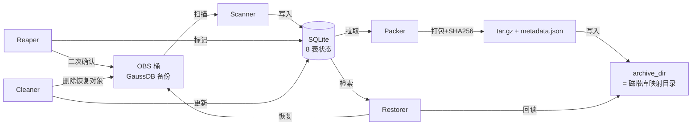
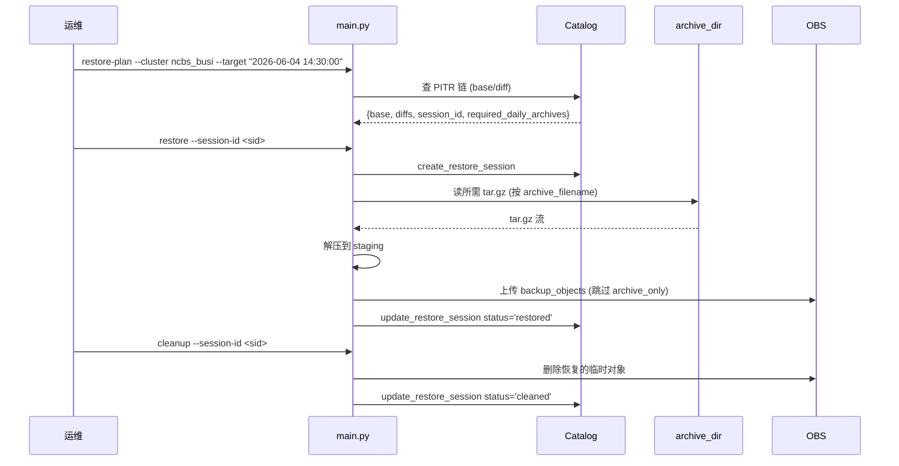

# gaussdb-archive

**GaussDB DBS 备份 → OBS → 归档目录 (周度打包 + PITR 恢复系统)**

自动发现 GaussDB 在 OBS 桶中的全量/差异/快照/xlog 备份,按**周度**(per-cluster 可配置起点 1-7)打包到配置的 `archive_dir` 目录,跳过元数据,严格按 xlog 时间窗过滤,清理已归档的 OBS 原始数据,并支持时间点恢复 (PITR)。

> 8 个核心模块 · 115/115 测试通过 · 10 个原子 Commit

---

## 目录

- [项目目标](#项目目标)
- [架构设计](#架构设计)
- [执行流程](#执行流程)
- [安装](#安装)
- [使用](#使用)
- [Catalog 数据模型](#catalog-数据模型)
- [状态机](#状态机)
- [测试与质量](#测试与质量)
- [安全设计](#安全设计)
- [配置参考](#配置参考)
- [集群示例](#集群示例)

---

## 项目目标

DBS 备份在 OBS 上累积后,会长期占用对象存储成本。本系统在不打破 PITR 能力的前提下,将每周备份**周度打包**转储到 `archive_dir` (即"磁带库映射目录"),并清理 OBS。

**核心约束**:
- **不丢恢复能力**: 转储后,任意历史时间点仍可恢复到 OBS (只要在 `retention_days` 窗口内)
- **Reaper 永不自启**: 删除线上 OBS 数据是单向破坏性操作,必须人工二次确认
- **集群隔离**: 多 GaussDB 实例共享同一份代码和归档目录,按 `instance_id` 严格隔离
- **状态可重入**: 任何步骤中断后可从 catalog 恢复进度,无需重新扫描
- **周度边界可配**: 每集群独立 `week_start_day` (1=周一..7=周日),ncbs_busi 周六全备,trgl_busi 周二,等
- **xlog-only**: `Log/` 目录仅打包 xlog 分片,5 类元数据 (obs_last_clean_record 等) 与根级 metadata 一律跳过

---

## 架构设计

### 数据流



### 模块清单

| 模块 | 职责 |
|---|---|
| `src/catalog.py` | SQLite 8 表状态库,事务隔离,UPSERT 语义 |
| `src/scanner.py` | OBS 增量扫描,PITR 链自动重建,元数据归档但不上传 |
| `src/packer.py` | 周度打包 → tar.gz + metadata.json,过滤 metadata, xlog 时间窗,直接写 archive_dir |
| `src/manifest.py` | metadata.json 构造: 集群 + 周度范围 (UTC+Beijing) + 详细目录条目 + xlog 摘要 |
| `src/utils.py` | 时区工具: utc_to_beijing, format_beijing |
| `src/week_boundary.py` | 周度边界计算: compute_week_range(today, week_start_day) |
| `src/reaper.py` | 5 道安全门禁 + ETag 二次校验,标记 `obs_deleted` |
| `src/restorer.py` | PITR 计划生成 + 执行 + Snapshot 独立恢复,从 archive_dir 读 |
| `src/cleaner.py` | 5 道门禁清理,完成态机收尾 |
| `src/obs_client.py` | OBS 客户端抽象 (生产 / Mock) |
| `src/policy.py` | 策略校验,运行时一致性检查, week_start_day 1-7 校验 |
| `src/models.py` | dataclass: `Policy` / `BackupObject` / `DailyArchive` / `RestoreSession` |
| `src/errors.py` | 异常层级 (`ArchiveError` 基类) |
| `src/config.py` | 加载 `archive_config.json` |

### 归档目录 (archive_dir) 即磁带库

`archive_dir` 字段 (顶层, 替代旧的 `tape` 段) 指定一个**目录路径**。该目录就是"磁带库的映射目录":
- Packer 把周度 `tar.gz` 写入该目录
- Restorer 从该目录读 `tar.gz` (按 `daily_archives.archive_filename`)
- 无需磁带卷管理、无需 position、无需 quota、无需回读校验 (本地 SHA256 即可)

### 周度归档命名

```
{alias}_W{start_YYYYMMDD}_{end_YYYYMMDD}.tar.gz
```

例: `ncbs_busi_W20260530_20260606.tar.gz` (周六起点 ncbs_busi)

### PITR 链

- **基础**: 一次 `full` 备份,作为链的起点
- **增量**: 多个 `diff` 备份,记录每个 diff 目录名
- **xlog 窗口**: `[base_full_time, target_time + xlog_forward_hours]`,默认 ±6h
- **链自动重建**: `scanner.scan_instance` 末尾自动拼接新发现的全量/差异为一条链
- **开放链**: `chain_end_time = NULL` 表示未关闭,可匹配任意未来 `target_time`

---

## 执行流程

### 周度流水线

```
scan → queued_for_archive → pack_weekly (per-cluster 当前周) → archive_dir
   │         │                       │
   │         │                       └─ 过滤 metadata / archive_only; xlog 时间窗
   │         └─ 调度器自动推进 (discovered → queued_for_archive)
   └─ Reaper 永不自启, 单独人工触发子命令 reap --week-start YYYY-MM-DD
```

**流水线简化**: 移除原 `scan → pack → archive` 三阶段,改为 `scan → pack_weekly` 两阶段。`pack_weekly` 直接把 `tar.gz` 写到 `archive_dir`,完成后 daily_archive 立即 `archived`, backup_objects 立即 `archived`。

### metadata.json (内含 tar.gz)

```json
{
  "schema_version": "2.0",
  "archive_type": "weekly",
  "cluster": {
    "alias": "ncbs_busi",
    "instance_id": "tenant_a_dbbd7e9b_ncbs_busi",
    "display_name": "核心数据库集群",
    "bucket": "dbsbucket-0-tj01-xxxx"
  },
  "archive_period": {
    "week_start_day": 6,
    "week_start_utc": "2026-05-30T00:00:00+00:00",
    "week_end_utc": "2026-06-06T00:00:00+00:00",
    "week_start_beijing": "2026-05-30 08:00:00 (UTC+8)",
    "week_end_beijing": "2026-06-06 08:00:00 (UTC+8)"
  },
  "contents": {
    "full_dirs": [
      {"dir_name": "1780160839955", "timestamp_ms": 1780160839955,
       "utc": "2026-05-30T10:27:19+00:00", "beijing": "2026-05-30 18:27:19"}
    ],
    "diff_dirs": [...],
    "snapshot_dirs": [],
    "xlog_summary": {
      "count": 128,
      "last_modified_first_utc": "...", "last_modified_last_utc": "...",
      "last_modified_first_beijing": "...", "last_modified_last_beijing": "...",
      "lsn_start": "0000000100000000000000A0",
      "lsn_end":   "0000000100000000000000F8"
    }
  },
  "totals": {
    "full_count": 1, "diff_count": 6, "snapshot_count": 0, "xlog_count": 128,
    "metadata_skipped_count": 12,
    "total_uncompressed_bytes": 9876543210,
    "compressed_tar_bytes": 1234567890
  },
  "checksum_sha256": "abc123...tar.gz.sha256"
}
```

### Preview 模式 (--preview)

`pack-weekly --preview` 输出**人类可读**计划清单, 含 Beijing time 转换:

```
集群: ncbs_busi (核心)
周度范围: 2026-05-30 08:00:00 (UTC+8) → 2026-06-06 08:00:00 (UTC+8)
周起点: 6 (1=周一..7=周日)

全量目录 (1 个):
  - 1780160839955 → Beijing=2026-05-31 09:07:19 (UTC=2026-05-31T01:07:19.955000+00:00)
差异目录 (1 个):
  - 1780177759671 → Beijing=2026-05-31 13:49:19 (UTC=...)
xlog 文件 (1 个):
  - last_modified 范围: 2026-06-03 18:00:00 → 2026-06-03 18:00:00
元数据 (跳过, archive_only): 2 个
```

无任何 IO, 不下载不写盘不创建 daily_archive 行。

### PITR 恢复流程



---

## 安装

```bash
git clone https://github.com/opswm/gaussdb-obs-tape-archive.git
cd gaussdb-obs-tape-archive
python -m venv .venv
source .venv/bin/activate  # Windows: .venv\Scripts\activate
pip install -e .
cp config/archive_config.json.example config/archive_config.json
$EDITOR config/archive_config.json
```

**环境变量** (凭证, **不要入库**):
```bash
export OBS_ACCESS_KEY="<your_key>"
export OBS_SECRET_KEY="<your_secret>"
```

---

## 使用

### CLI 子命令

| 子命令 | 用途 | 关键参数 | 是否可自动 |
|---|---|---|---|
| `scan` | 扫描 OBS, 发现新备份 | `--cluster` (可选) | ✅ |
| `pack-weekly` | 周度打包 (推荐) | `--cluster` `--week-start YYYY-MM-DD` `--preview` | ✅ |
| `pack` | 同 `pack-weekly` (别名) | 同上 | ✅ |
| `reap` | 标记 OBS 对象为 `obs_deleted` | `--cluster` `--week-start` `--dry-run` | ❌ 人工 |
| `restore-plan` | 生成 PITR 恢复计划 | `--cluster` `--target "YYYY-MM-DD HH:MM:SS"` | ❌ 人工 |
| `restore` | 执行恢复 (archive_dir → OBS) | `--cluster` `--target` `--session-id` | ❌ 人工 |
| `cleanup` | 清理恢复数据 | `--session-id` | ❌ 人工 |
| `status` | 查看集群归档状态 | `--cluster` `--week-start` (可选) | ✅ |

### 完整命令示例

```bash
# 扫描所有集群
python main.py --config config/archive_config.json scan

# 扫描指定集群
python main.py --config config/archive_config.json scan --cluster ncbs_busi

# 周度打包 (默认当前周, per-cluster week_start_day)
python main.py --config config/archive_config.json pack-weekly --cluster ncbs_busi

# 指定周打包
python main.py --config config/archive_config.json pack-weekly --cluster ncbs_busi --week-start 2026-05-30

# 预览 (不下载不写盘)
python main.py --config config/archive_config.json pack-weekly --cluster ncbs_busi --preview

# 人工 Reap (整周, 先 dry-run 确认)
python main.py --config config/archive_config.json reap --cluster ncbs_busi --week-start 2026-05-30 --dry-run
python main.py --config config/archive_config.json reap --cluster ncbs_busi --week-start 2026-05-30

# PITR 恢复
python main.py --config config/archive_config.json restore-plan --cluster ncbs_busi --target "2026-06-04 14:30:00"
python main.py --config config/archive_config.json restore --cluster ncbs_busi --target "2026-06-04 14:30:00" --session-id <sid>

# 清理已恢复数据
python main.py --config config/archive_config.json cleanup --session-id <sid>

# 查看状态
python main.py --config config/archive_config.json status --cluster ncbs_busi
python main.py --config config/archive_config.json status --cluster ncbs_busi --week-start 2026-05-30
```

### 周度自动调度 (推荐)

```bash
# crontab -e
# 每周日 02:00 跑周度流水线 (per-cluster 当前周)
0 2 * * 0 cd /data/gaussdb-archive && \
  /data/gaussdb-archive/.venv/bin/python -m scheduler config/archive_config.json \
  >> /var/log/gaussdb-archive/weekly.log 2>&1
```

---

## Catalog 数据模型

### 8 张表

| 表 | 主键 | 用途 |
|---|---|---|
| `instance_mappings` | `instance_id` | 集群元数据 (alias / display_name / bucket / enabled) |
| `cluster_archive_policies` | `instance_id` | 归档策略 (4 个 archive_* 开关 + retention + xlog 窗口 + `week_start_day`) |
| `backup_objects` | `id`, `obs_key UNIQUE` | OBS 原始对象清单 + 状态机 |
| `daily_archives` | `id`, `(instance_id, archive_date) UNIQUE` | 周度归档包 (一个 tar.gz; `archive_date` = 周起始日) |
| `pitr_chains` | `chain_id` | PITR 链 (base_full_dir + diff_dirs + 时间窗口) |
| `restore_sessions` | `session_id` | 恢复会话 (target_time + 所需 daily_archives) |
| `restore_objects` | `(session_id, obs_key)` | 恢复产生的临时对象 (Cleaner 时清理) |
| `operation_log` | `id` | 操作审计 (run_id / status / error_message) |

### `daily_archives` 核心列 (精简后)

| 列 | 类型 | 用途 |
|---|---|---|
| `archive_date` | TEXT | 周起始日 (ISO YYYY-MM-DD, 即 `week_start`) |
| `archive_week_end` | TEXT | 周截止日 (排他, ISO YYYY-MM-DD) |
| `archive_filename` | TEXT | tar.gz 文件名 (如 `ncbs_busi_W20260530_20260606.tar.gz`) |
| `status` | TEXT | `pending` (写入中) / `archived` (已落 archive_dir + SHA256 校验) |
| `checksum_sha256` | TEXT | tar.gz 整体 SHA256 |
| `manifest_json` | TEXT | 内嵌的 metadata.json (完整) |
| `metadata_skipped_count` | INT | 本周跳过的 metadata 数量 |

### `backup_objects` 核心列 (精简后)

| 列 | 类型 | 用途 |
|---|---|---|
| `obs_key` | TEXT UNIQUE | OBS 全路径 (如 `{instance_id}/Log/cn*/pg_xlog/.../f.rch`) |
| `instance_id` | TEXT | 集群标识 |
| `backup_type` | TEXT | `full` / `diff` / `snapshot` / `xlog` / `metadata` |
| `parent_backup_dir` | TEXT | 备份时间戳目录名 (如 `1780160839955`) |
| `status` | TEXT | `discovered` / `queued_for_archive` / `archived` / `obs_deleted` |
| `restore_policy` | TEXT | `normal` / `archive_only` (metadata 一律 archive_only, 跳过打包) |
| `daily_archive_id` | INT | 所属 weekly_archive |
| `checksum_sha256` | TEXT | 单对象 SHA256 |
| `obs_etag` | TEXT | Reaper 二次校验用 |
| `obs_deleted_at` / `obs_deleted_by` | TEXT | Reaper 标记 |

---

## 状态机

### `backup_objects.status`

```
discovered ──scan──▶ queued_for_archive ──pack_weekly──▶ archived ──reap──▶ obs_deleted
                                                                          └─[终态]
```

### `daily_archives.status` (二态)

```
pending (catalog 行刚创建) ──pack_weekly 写 archive_dir + SHA256 校验──▶ archived
```

---

## 测试与质量

```bash
pytest              # 115 用例, ~0.3s 全量
```

### 测试矩阵

| 模块 | 测试文件 | 用例数 |
|---|---|---|
| catalog | test_catalog.py | 7 |
| cleaner | test_cleaner.py | 5 |
| cli | test_cli.py | 6 |
| config | test_config.py | 2 |
| e2e | test_e2e.py | 4 |
| errors | test_errors.py | 6 |
| models | test_models.py | 4 |
| obs_client | test_obs_client.py | 6 |
| packer | test_packer.py | 8 |
| policy | test_policy.py | 13 |
| reaper | test_reaper.py | 5 |
| restorer | test_restorer.py | 8 |
| scanner | test_scanner.py | 8 |
| utils | test_utils.py | 26 |
| **合计** | **14 文件** | **115** |

---

## 安全设计

### Reaper 5 道门禁 (`src/reaper.py`)

1. **类型门**: daily_archive 状态必须 `archived`
2. **完整性门**: 所有 backup_objects 状态必须 `archived` + SHA256 存在
3. **依赖门**: 同 `parent_backup_dir` 的对象**全部** archived
4. **顺序门**: `full` → `snapshot` → `diff` → `xlog` 严格分层, 累计必须等于总数才进入下一阶段
5. **ETag 门**: 拉取 OBS 当前 ETag, 必须等于扫描时记录的 `obs_etag` (防 OBS 端数据被改动)
6. **人为门**: CLI 必须显式触发, scheduler 永不自启

任何一道失败 → **硬失败 (raise `UnsafeDeleteError`)**, 不静默跳过.

### Cleaner 5 道门禁

1. 会话状态必须是 `restored`
2. 每个 `restore_object` 的 `obs_etag` 仍存在
3. 源 `backup_object` 已是 `obs_deleted` (Reaper 跑过)
4. 同 `session_id` 所有对象**全部检查通过**才执行
5. 终态: `cleaned` (成功) / `failed` (运维介入)

### Packer 过滤规则

- `Log/` 目录: 仅取 xlog (`Log/<node>/pg_xlog/tl_*/<seg>/<file>`)
- 元数据 (5 类 `LOG_NODE_METADATA_FILES` + `recovery_interval/*` + `backup_metadata.cfg`/`incr_backup_metadata.cfg`) 一律 `restore_policy='archive_only'`,**不进** tar.gz
- xlog 严格按 `[week_start_iso, week_end_iso)` UTC 闭开区间取

### 凭证隔离

- 配置文件只存模板, 真实凭证走 `env:` 占位符
- `.env` / `config/archive_config.json` / `.omc/` / `.claude/` 已在 `.gitignore`
- 历史已用 `git-filter-repo` 永久清理 (2026-06-11)

---

## 配置参考

`config/archive_config.json.example` 是完整模板, 关键字段:

```json
{
  "obs": {
    "bucket_name": "dbsbucket-0-tj01-XXXX",
    "endpoint": "https://obs.tj01.xxxxx.myhuaweicloud.com",
    "access_key": "env:OBS_ACCESS_KEY",
    "secret_key": "env:OBS_SECRET_KEY",
    "concurrency": 8,
    "part_size_mb": 10
  },
  "instances": [
    {
      "alias": "ncbs_busi",
      "instance_id": "{tenant}_{instance}",
      "display_name": "核心数据库集群",
      "enabled": true,
      "archive_policy": {
        "archive_full": true, "archive_snapshot": true,
        "archive_diff": true, "archive_xlog": true,
        "retention_days": 90,
        "xlog_redundancy_hours": 6.0, "xlog_forward_hours": 6.0,
        "week_start_day": 6
      }
    }
  ],
  "archive_dir": "/data/tape-mapping",
  "catalog": {
    "path": "/data/catalog/gaussdb_archive.db",
    "backup_enabled": true,
    "backup_path": "/data/catalog/backups/",
    "backup_retention_days": 90
  },
  "work_dir": "/data/archive_work",
  "archive": {
    "required_manual_confirm_for_delete": true,
    "max_concurrent_pack_jobs": 3,
    "daily_archive_format": "tar.gz",
    "compression_level": 6
  },
  "restore": {
    "local_work_retention_hours": 24
  }
}
```

> ⚠️ `instance_id` 必须是**完整**的 `{tenant_id}_{instance_id}` 字符串 (来自 OBS 实际目录名), 不可简化为别名. `alias` 才是简称 (如 `ncbs_busi`)。

### 策略字段说明

| 字段 | 含义 |
|---|---|
| `archive_full` | 是否归档全量备份 |
| `archive_snapshot` | 是否归档快照 |
| `archive_diff` | 是否归档差异备份 (关掉 = 无 PITR) |
| `archive_xlog` | 是否归档事务日志 (关掉 = 无 PITR) |
| `retention_days` | 磁带保留天数 (到期后由外部流程覆盖) |
| `xlog_redundancy_hours` | xlog 窗口前向冗余 (默认 6h) |
| `xlog_forward_hours` | xlog 窗口后向冗余 (默认 6h, PITR 必备) |
| `week_start_day` | **新增** 周度起点 (1=周一..7=周日, 默认 6=周六) |

**PITR 能力判定**: `archive_full AND archive_diff AND archive_xlog` 全部为 `true` 才支持任意时间点恢复。

---

## 集群示例

| alias | display_name | 策略 | week_start_day | PITR 能力 |
|---|---|---|---|---|
| `ncbs_busi` | 核心数据库集群 | full + snapshot + diff + xlog | 6 (周六) | ✅ |
| `trgl_busi` | 总账数据库集群 | full + snapshot + diff + xlog | 2 (周二) | ✅ |
| `itps_busi` | 柜面数据库集群 | full + snapshot + diff (无 xlog) | 4 (周四) | ❌ 仅快照恢复 |

---

## License

内部运维工具,未开源。
